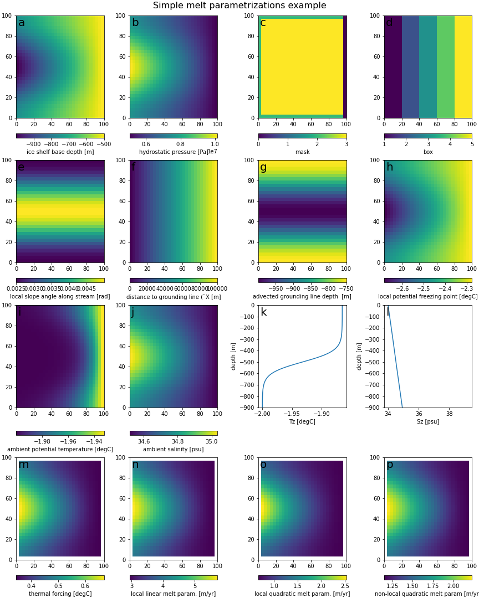

# `melt` project: comparing ice shelf melt models
## Intercomparison of different models of basal melt

### Models considered:
1. Simple: simple parametrizations based on thermal driving, i.e. difference between pressure freezing temperature and in-situ ocean temperature (e.g. Favier _et al._ (2019))
1. Plume: analytical approximtation of the 1D plume model (Lazeroms _et al._ (2019))
1. PICO: box model of cavity circulation (Reese _et al._ (2018))
1. PICOP: combination the two abovementioned models (Pelle _et al._ (2019))
1. Layer: 2D (vertically integratd) plume model (Hellmer _et al._ (1989))
### Example Ice Shelf: Totten Glacier


__Figure 1:__  Geometry of the Totten Ice Shelf. The data in the top row is provided by the Bedmachine dataset. Left to right: surface elevation, bed topography/bathymetry, and ice thickness. Bottom left, derived draft of the ice shelf (elevation-thickness) together with the grounding line (blue) and the ice shelf front (red). Bottom center and right: minimum distance to the grounding line/ice shelf front.

## Repository structure
```
melt
│   README.md
│   LICENSE
│
└───data
│   └───BedMachine           (Antarctic topography data; not committed here)
│   │   │   BedMachineAntarctica_2020-07-15_v02.nc
│   │
│   └───IceVelocity          (Radar derived surface velocities; not committed here)
│   │   │   antarctic_ice_vel_phase_map_v01.nc
│   │
│   └───mask_polygons        (polygons to select areas; created vi QGIS)
│       │   *_grl.geojson    (polygons around grounding lines, continent only)
│       │   *_grl2.geojson   (polygons around grounding lines, including islands)
│       │   *_isf.geojson    (polygons around ice shelf front)
│       │   *_polygon.geojson(polygons around whole ice shelf)
│
└───doc                      (documentation)
|   |   environment.yml      (conda environments file)
│
└───results                  (images & netcdf files, mostly not committed)
│   
└───src
    └───ipynb                (notebooks with output; not committed)
    │   │   BedMachineAntarctica_2020-07-15_v02.nc
    │
    └───notebooks            (notebooks without output; version controlled)
    │   │   example.ipynb    (recreate figure from README.md)
    │   │   ...
    │
    │   forcing.py        │
    │   ideal_geometry.py │  (set up model domains)
    │   real_geometry.py  │
    │   PICO.py         │
    │   PICOP.py        │
    │   Plume.py        │    (models)
    │   sheet.py        │
    │   Simple.py       │
    │   advect.py         │
    │   constants.py      │  (auxiliary functions)
    │   sheet_utils.py    │
```

### How to run models

0. install the necessary packages\
   e.g., using `conda env create -f environment.yml` [creates a conda environment](https://conda.io/projects/conda/en/latest/user-guide/tasks/manage-environments.html#creating-an-environment-from-an-environment-yml-file) named `ice` which should be able to execute all the code

1. choose geometry
    ```python
    from ideal_geometry import IdealGeometry
    ds = IdealGeometry('test3').create()
    ```
    realistic ice shelf geometries (with tht `RealGeometry` calss in `real_geometry.py`) require downloading the BedMachine topography and ice velocity data and placing it in the correct folder (see structure above)
2. choose forcing (temperature and salinity profiles)
    ```python
    from forcing import Forcing
    pdict = dict(Tdeep=-2, ztcl=500)
    ds = Forcing(ds).tanh(**pdict)
    ```
    other forcing profiles are part of the `Forcing` class, including `constant`, `tanh2`, `favier`, `isomip`, `isomipfrac`, `holland`, `holland07`
3. pass those to model of choice
    ```python
    from Simple import SimpleModels
    ds = SimpleModels(ds).compute()
    ```



__Figure 2:__ The results from following the example above: applying the `Simple` melt parametrizations on the `test3` with a `tanh` forcing profile.
The draft (a) is prescribed, the hydrostatic pressure (b) is linearly related, the mask (c) specifies grounding line (2), ice shelf (3), and ice shelf front (0), the number of boxes is given but the distribution (d) is calculated.
Panels (e-g) show quantities needed for one or more melt model: the local slope angle along the flowline (here simply left to right), the distance to the grounding line, and the depth at the plume origin.
Panel (h) shows the local freezing point, (i/j) the spatial distribution of temperature and salinity, (k/l) the temperature and salinity depth profiles.
Panel (m) shows the thermal forcing (temperature minus local freezing point).
Finally (n-p) show the three simple melt parameterizations: the local linear, local quadratic, and non-local quadratic ones, respectively

## Disclaimer
This is work in progress and we do not guarantee anything. Contact us if you have questions, and if you find this useful also let us know.

## References
> Favier,  Lionel et al.  (June  2019a). “Assessment of  sub-shelf melting  parameterisations using  the ocean–ice-sheet coupled model NEMO(v3.6)–Elmer/Ice(v8.3)”. Geoscientific  Model  Development 12.6., pp. 2255–2283.doi:10.5194/gmd-12-2255-2019.
>
>Hellmer, H. H. and D. J. Olbers (Dec. 1989). “A two-dimensional model for the thermohaline circulation under an iceshelf”. Antarctic Science 1.4. pp. 325–336.issn: 1365-2079, 0954-1020. doi:10.1017/S0954102089000490
>
> Lazeroms, Werner M.J. et al. (2019b). “An analytical derivation of ice-shelf basal melt based on the dynamics of meltwater plumes”. Journal of Physical Oceanography 49.4, pp. 917–939. doi:10.1175/JPO-D-18-0131.1
>
> Pelle, Tyler, Mathieu Morlighem, and Johannes H. Bondzio (Apr. 2019a). “Brief communication: PICOP, a new ocean melt parameterization under ice shelves combining PICO and a plume model”. The Cryosphere 13.3. pp. 1043–1049. doi:10.5194/tc-13-1043-2019
>
> Reese,  Ronja  et  al.  (June  2018a).  “Antarctic  sub-shelf  melt  rates  via PICO”.  The  Cryosphere 12.6. pp. 1969–1985. doi:10.5194/tc-12-1969-2018.
