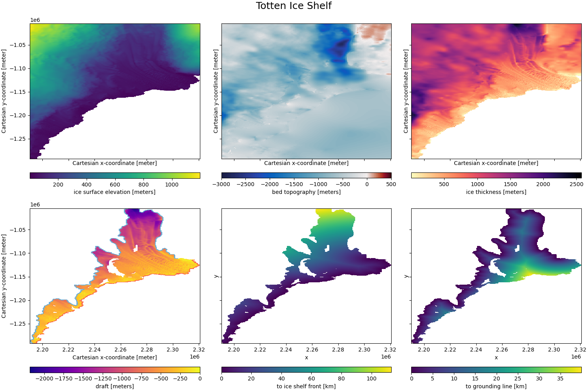

# melt: playing with ice shelf melt models

## Example Ice Shelf: Totten Glacier
data from the Bedmachine dataset; figure created in `src/notebooks/Bedmachine.ipynb`

__Figure 1:__  Geometry of the Totten Ice Shelf. The data in the top row is provided by the Bedmachine dataset. Left to right: surface elevation, bed topography/bathymetry, and ice thickness. Bottom left, derived draft of the ice shelf (elevation-thickness) together with the grounding line (blue) and the ice shelf front (red). Bottom center and right: minimum distance to the grounding line/ice shelf front.

## models of ice shelf melt

1. analytical approximtation ot the 1D plume model (Lazeroms _et al._ (2019)
2. PICO model (Reese _et al._ (2018))
3. PICOP model which combines the two abovementioned models (Pelle _et al._ (2019))

### 1. recreating the Lazeroms _et al._ (2019) plume model

model in `src/Plume.py`, recreated figures (bottom or right) in `src/notebooks/Plume.ipynb`

#### Figure 4
 

#### Figure 6

#### Figure A1
  

### 2. recreating the Reese _et al._ (2018) PICO model
